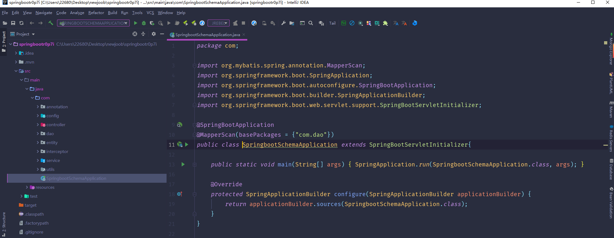
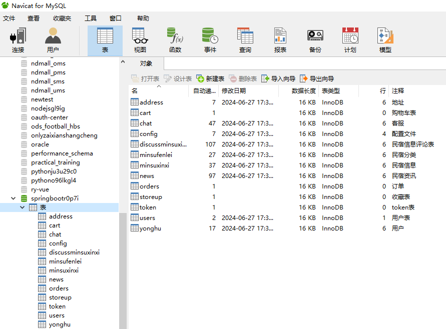
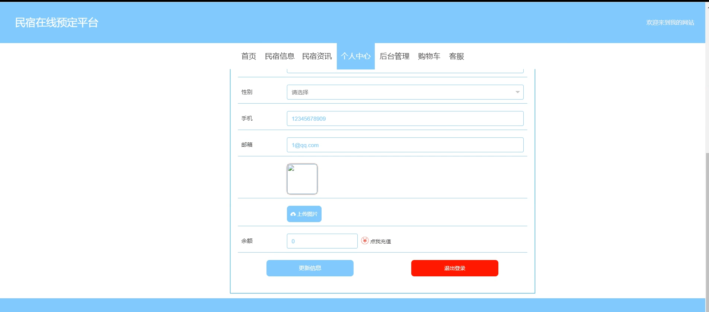
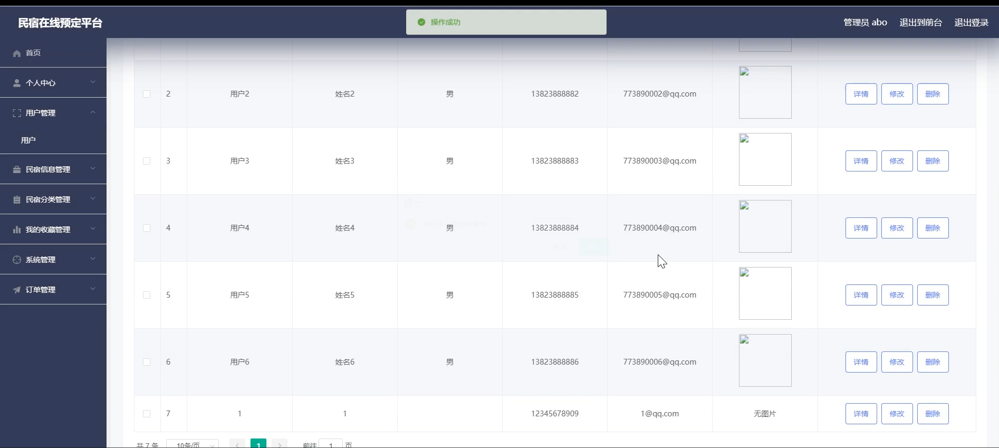
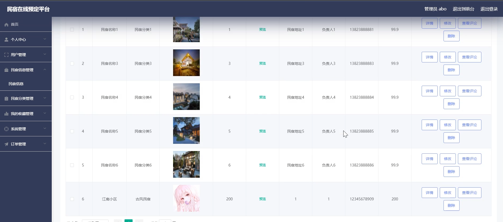
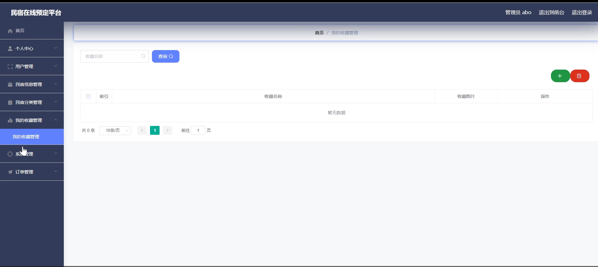
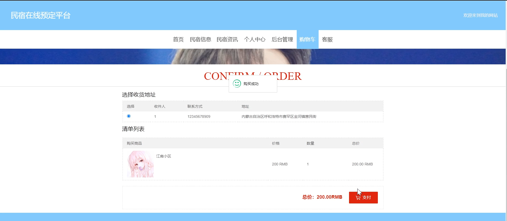
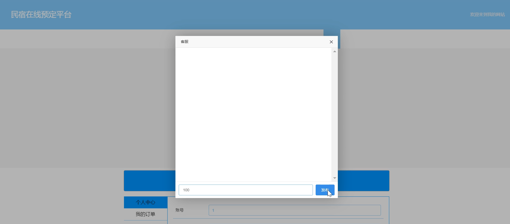
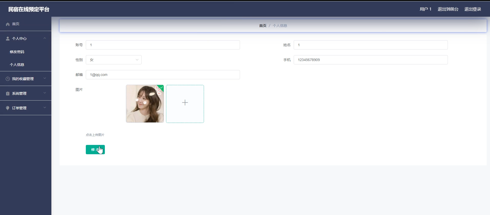

# 基于springboot的民宿在线预定平台

<h4 style='color:red'>联系不到我，就看我的主页 </h4> 
 
#### 介绍

随着旅游业的蓬勃发展和人们对个性化住宿需求的增加，民宿作为一种独特的住宿选择受到越来越多游客的青睐。本基于 Spring Boot 的民宿在线预定平台旨在为用户提供便捷、高效、可靠的民宿预定服务，同时为管理员提供全面、精细的管理功能，以促进民宿行业的规范化和优质化发展。

#### 技术栈

后端技术栈：Springboot+Mysql+Maven

前端技术栈：Vue+Html+Css+Javascript+ElementUI

开发工具：Idea+Vscode+Navicate

#### 系统功能介绍

（一）管理员角色  

个人中心：查看和编辑个人信息，接收系统通知和重要消息。  
用户管理：审核用户注册申请，管理用户资料，包括权限设置、信息修改等。  
民宿信息管理：添加、修改和删除民宿的详细信息，如地址、房型、设施、价格等。  
民宿分类管理：对民宿进行分类，如按地域、风格、价格区间等，方便用户筛选。  
我的收藏管理：查看和管理自己收藏的民宿相关信息。  
系统管理：进行系统的配置和维护，包括服务器设置、数据备份与恢复等。  
订单管理：处理用户的订单，包括确认订单、安排入住、处理退款等。  

（二）用户角色  

民宿信息：浏览各类民宿的详细介绍、图片、评价等信息。  
民宿资讯：获取民宿行业的最新动态、旅游攻略、优惠活动等资讯。  
个人中心：修改个人资料、设置偏好、查看订单历史和收藏记录。  
后台管理  
我的收藏管理：管理自己收藏的心仪民宿。  
系统管理：了解系统的使用规则和常见问题解答。  
订单管理：查看订单状态、进行订单支付、取消或修改订单。  
购物车：将心仪的民宿添加到购物车，方便对比和批量预定。  
客服：与客服人员进行在线沟通，咨询问题和寻求帮助。  

#### 系统作用

方便用户出行安排  
用户能够轻松浏览和筛选符合自己需求的民宿，提前做好出行规划。  
在线预定功能节省了用户寻找和预订民宿的时间和精力。  
提升民宿管理效率  
管理员可以高效地管理民宿信息和订单，及时响应和处理用户需求。  
民宿分类管理有助于提高民宿信息的准确性和规范性。  
促进民宿行业发展  
为优质民宿提供更广泛的展示平台，增加曝光度和预订量。  
推动民宿行业的规范化和标准化，提升整体服务质量。  
增强用户体验  
提供民宿资讯和客服支持，使用户在预订过程中得到充分的帮助和指导。  
购物车和收藏功能满足用户的个性化需求，提高用户满意度。  

#### 系统功能截图

代码结构

数据库表

登录

前台页面首页

个人中心

用户管理

民宿信息管理

我的收藏股管理

购物车

客服

用户端后台管理

#### 总结

本基于 Spring Boot 的民宿在线预定平台，通过清晰的角色功能划分和丰富的服务内容，实现了用户与民宿资源的有效对接。管理员能够有效地管理和优化平台运营，用户能够便捷地预定心仪的民宿。未来，随着技术的不断进步和市场需求的变化，该平台将持续改进和创新，为用户和民宿经营者提供更优质、更智能的服务，推动民宿行业的繁荣发展。

#### 使用说明

创建数据库，执行数据库脚本 修改jdbc数据库连接参数 下载安装maven依赖jar 启动idea中的springboot项目

后台地址：http://localhost:8080/springbootr0p7i/admin/dist/index.html

管理员  abo 密码 abo

前台地址：http://localhost:8080/springbootr0p7i/front/index.html

